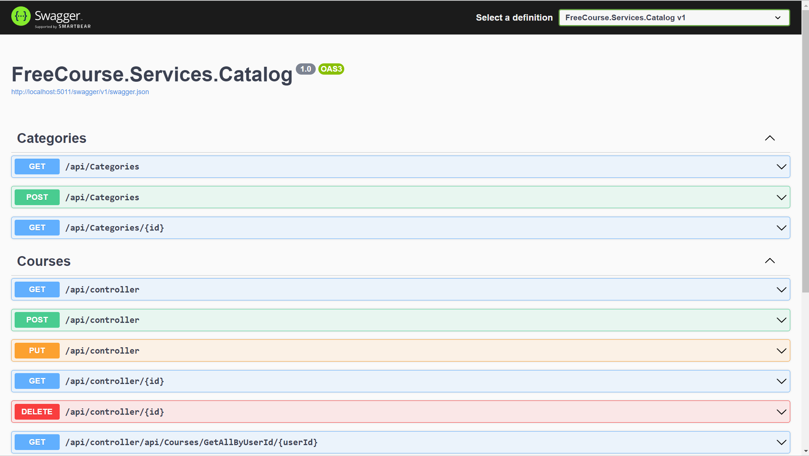

# MicroServicesProject

### Catalog Microservice
Our microservice responsible for storing and presenting information about our courses.
 
• MongoDB (Database)  
• One-To-Many/One-To-One relationship 

### Basket Microservice
Our microservice responsible for managing the shopping cart. 
• RedisDB (Database)

### Discount Microservice
Our microservice responsible for managing discount coupons assigned to users. 
• PostgreSQL (Database) 
• Dapper (Micro ORM) 

### Order Microservice
Our microservice responsible for managing orders. 
We developed this microservice using the Domain Driven Design approach. 
We used the MediatR library to implement the CQRS design pattern in this microservice. 
• SQL Server (Database) 
• Domain Driven Design 
• CQRS (MediatR Library) 

### FakePayment Microservice
Our microservice responsible for handling payments. 

### IdentityServer Microservice
• SQL Server (Database) 
Our microservice responsible for managing user data, generating access tokens and refresh tokens. 

### PhotoStock Microservice
Our microservice responsible for storing and presenting course photos. 

### API Gateway
• Ocelot Library 

### Message Broker
• We used RabbitMQ as our message queue system. 
• We used the MassTransit library to communicate with RabbitMQ. 
• RabbitMQ (MassTransit Library) 

### Identity Server
• Generating tokens and refresh tokens 
• Protecting our microservices with access tokens 
• Building a structure that complies with OAuth 2.0 / OpenID Connect protocols. 

